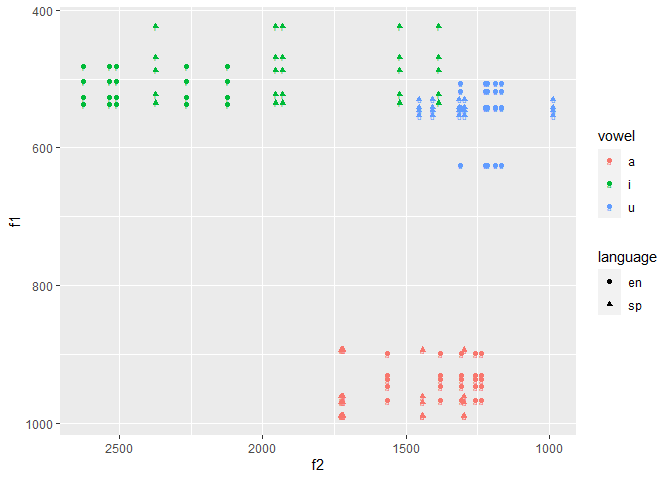
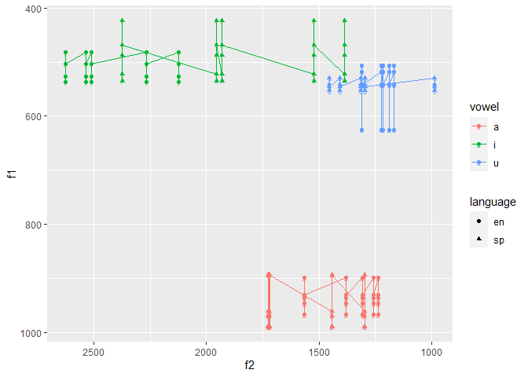

------------------------------------------------------------------------

## output: github\_document

# PROGRAMING ASSIGNMENT 3

``` r
library("dplyr")   
```

    ## 
    ## Attaching package: 'dplyr'

    ## The following objects are masked from 'package:stats':
    ## 
    ##     filter, lag

    ## The following objects are masked from 'package:base':
    ## 
    ##     intersect, setdiff, setequal, union

``` r
library("ggplot2") 
library("readr")   
library("here")    
```

    ## here() starts at C:/Users/gcons/Desktop/pa_3

``` r
library("tidyr")
library("stringr")
```

# Answering Questions from Task 7.

1.  “vonset = Get starting point:2,2” refers to the start (onset) of the
    the vowel (as marked on the textgrid) and the number 2 refers to the
    tier in which this measurement is located (i.e., second tier of the
    textgrid). The same for the following line, “voffset = Get end
    point: 2,2”, with the exception that this time, it’s about the end
    of the vowel (as marked on the textgrid). The third line of code,
    “durationV = voffset - vonset” simply calculates the duration of the
    vowel through a substraction of the lower value (i.e., vonset) from
    the higher value (i.e., voffset).

2.  The general outline of the script can be summarized as follows:

-   We first set up the output file and tell the divine forces of coding
    where we want to save the file (i.e, establish a path). At this
    point, we are also naming the file and naming the headers (e.g.,
    *item*, *vowel*, etc.)
-   Then, things get a bit more interesting and we set up a loop. In
    order to do this, we first set the path to the stim files, since
    this is where the divine forces of coding will find the needed
    information to get values.
-   At this point, we are basically telling the code what to do: go to
    the wav and textgrid files and check the data (that’s where you’re
    going to get all the info from!).
-   Then, things get more interesting and the code is working on
    *getting the item and vowel label*, as well as the *language label
    and time landmark*. -Similarly, the code is extracting the values
    (measurements) that we are asking it to extract for f1 and f2 and
    tl.
-   Finally, we are telling the code to *print the results to window and
    save to.csv file*, which is coding lingo for *just save the values
    that you’ve been working on calculating in a specific file that has
    the .csv format*

1.  The first difference between the pa2 and pa3 is that for pa2, the
    textgrid contained only one tier (in which we included only the word
    and a digit representing the stressed syllable). For this pa3, we
    have three tiers. For pa2, we recorded all the words in one file and
    segmented them, but then we used the code to take the segmented
    words and create individual files (wav and textgrid) for each one of
    them. So, we ended up with a *segmented* folder that contained
    multiple wav and textgrid files (corresponding to the words we
    recorded and segmented). For pa3, we also recorded multiple words
    (embedded in carrier sentences) and segmented them but we did not
    use a code to create another folder that had a wav and a textgrid
    file for each one of the recordings. Then, for pa2, we had to use
    another script to extract the values that we wanted for each
    individual word.

I think there are advantages and disadvantages for both. I think the
script we used for pa3 makes more sense if we have longer bits of data,
such as interviews in which participants are spontaneously producing
data (aka we are not controlling what they say). Let’s say we wanted to
extract all the “a” vowels that the participant produces. I think the
type of script we used for pa3 might make more sense. But, if we were to
have different participants produce the same data, a script like the one
for pa2 might make more sense, because then we could compare the
segmented data across participants (e.g., look at everyone’s production
of the vowel “a” in *casa*). Ultimately, I’m not sure if these are
actual advantages or disadvantages, but these are some of the things I
can think of.

# Load and read vowel data

``` r
here("data")
```

    ## [1] "C:/Users/gcons/Desktop/pa_3/data"

``` r
read_csv(file = "./data/vowel_data.csv")
```

    ## 
    ## -- Column specification --------------------------------------------------------
    ## cols(
    ##   id = col_character(),
    ##   item = col_character(),
    ##   vowel = col_character(),
    ##   language = col_character(),
    ##   f1_cent = col_double(),
    ##   f2_cent = col_double(),
    ##   tl = col_double(),
    ##   f1_20 = col_double(),
    ##   f1_35 = col_double(),
    ##   f1_50 = col_double(),
    ##   f1_65 = col_double(),
    ##   f1_80 = col_double(),
    ##   f2_20 = col_double(),
    ##   f2_35 = col_double(),
    ##   f2_50 = col_double(),
    ##   f2_65 = col_double(),
    ##   f2_80 = col_double()
    ## )

    ## # A tibble: 36 x 17
    ##    id    item   vowel language f1_cent f2_cent    tl f1_20 f1_35 f1_50 f1_65
    ##    <chr> <chr>  <chr> <chr>      <dbl>   <dbl> <dbl> <dbl> <dbl> <dbl> <dbl>
    ##  1 gcd   meet   i     en          499.   1399.  225.  483.  487.  501.  508.
    ##  2 gcd   beat   i     en          490.   2696.  773.  442.  462.  495.  522.
    ##  3 gcd   feet   i     en          504.   2645. 1560.  524.  541.  583.  533.
    ##  4 gcd   seat   i     en          536.   2527. 5213.  487.  514.  533.  549.
    ##  5 gcd   heat   i     en          519.   2522. 1780.  493.  515.  518.  549.
    ##  6 gcd   fleet  i     en          517.   2678. 1221.  465.  506.  531.  565.
    ##  7 gcd   moss   a     en         1034.   1426.  421. 1052. 1060.  987. 1017.
    ##  8 gcd   bot    a     en          955.   1276.  348.  952. 1003.  941.  997.
    ##  9 gcd   fought a     en          940.   1370.  786.  899.  926.  994. 1008.
    ## 10 gcd   sought a     en          835.   1233.  364.  729.  850.  814.  849.
    ## # ... with 26 more rows, and 6 more variables: f1_80 <dbl>, f2_20 <dbl>,
    ## #   f2_35 <dbl>, f2_50 <dbl>, f2_65 <dbl>, f2_80 <dbl>

``` r
my_data <- read_csv(here("data", "vowel_data.csv"))
```

    ## 
    ## -- Column specification --------------------------------------------------------
    ## cols(
    ##   id = col_character(),
    ##   item = col_character(),
    ##   vowel = col_character(),
    ##   language = col_character(),
    ##   f1_cent = col_double(),
    ##   f2_cent = col_double(),
    ##   tl = col_double(),
    ##   f1_20 = col_double(),
    ##   f1_35 = col_double(),
    ##   f1_50 = col_double(),
    ##   f1_65 = col_double(),
    ##   f1_80 = col_double(),
    ##   f2_20 = col_double(),
    ##   f2_35 = col_double(),
    ##   f2_50 = col_double(),
    ##   f2_65 = col_double(),
    ##   f2_80 = col_double()
    ## )

# Manipulate dataframe to calculate F1/F2 centroids and Trajectory Lengths

``` r
vowels<-select(my_data,vowel, language,f1_cent,f2_cent,tl)
```

``` r
vowels_calc <- vowels%>% 
  group_by(vowel,language) %>% 
  summarize(f1_mean = mean(f1_cent), f1_sd = sd(f1_cent),
            f2_mean = mean(f2_cent), f2_sd = sd (f2_cent), 
                           tl_mean = mean (tl), tl_sd = sd(tl))
```

    ## `summarise()` has grouped output by 'vowel'. You can override using the `.groups` argument.

## However, if we wanted to have the average values separated into three distinct categories/groups, such as (1) F1 centroid, (2) F2 centroid, and (3) Trajectory Length, we could also do this:

### F1 mean

``` r
f1_mean <- vowels%>% 
  group_by(vowel,language) %>% 
  summarize(f1_mean = mean(f1_cent)) %>% 
  pivot_wider(names_from = language,
              values_from = f1_mean)
```

    ## `summarise()` has grouped output by 'vowel'. You can override using the `.groups` argument.

### F2 mean

``` r
f2_mean <- vowels%>% 
  group_by(vowel,language) %>% 
  summarize(f2_mean = mean(f2_cent)) %>% 
  pivot_wider(names_from = language,
              values_from = f2_mean)
```

    ## `summarise()` has grouped output by 'vowel'. You can override using the `.groups` argument.

### TL mean

``` r
tl_mean <- vowels%>% 
  group_by(vowel,language) %>% 
  summarize(tl_mean = mean(tl)) %>% 
  pivot_wider(names_from = language,
              values_from = tl_mean)
```

    ## `summarise()` has grouped output by 'vowel'. You can override using the `.groups` argument.

# Plots

## 1. Trajectory Length as a function of vowel and language

``` r
vowels %>% 
  ggplot(.,aes(x=tl, y=vowel, color=language))+
  geom_point()
```

<!-- -->

## 2. F1 as a function of vowel and language

``` r
vowels %>% 
  ggplot(.,aes(x=f1_cent, y=vowel, color=language))+
  geom_point()
```

<!-- -->

## 3. F2 as a function of vowel and language

``` r
vowels %>% 
  ggplot(.,aes(x=f2_cent, y=vowel, color=language))+
  geom_point()
```

<!-- -->

## 4. (Attempt at) Plotting trajectory length in F1/F2 vowel space

``` r
bonus_data <- select(my_data,-id, - item, -tl) %>% 
  group_by(vowel, language) %>% 
  summarize(f1_20=mean(f1_20), f1_35=mean(f1_35), f1_50=mean(f1_50),
            f1_65=mean(f1_65), f1_80=mean(f1_80), f2_20=mean(f2_20),
            f2_35=mean(f2_35), f2_50=mean(f2_50),
            f2_65=mean(f2_65), f2_80=mean(f2_80))
```

    ## `summarise()` has grouped output by 'vowel'. You can override using the `.groups` argument.

``` r
bonus<-bonus_data %>%
   pivot_longer(cols = c ("f1_20", "f1_35", "f1_50", "f1_65", "f1_80"), 
                 names_to = "F1", values_to = "value") %>% 
  separate(col=F1, into=c("f1", "time"), sep = "_") %>% 
  pivot_wider(names_from = f1, values_from = value) %>% 
  pivot_longer(cols = c ("f2_20", "f2_35", "f2_50", "f2_65", "f2_80"), 
                 names_to = "F2", values_to = "value") %>% 
  separate(col=F2, into=c("f2", "time"), sep = "_") %>% 
  pivot_wider(names_from = f2, values_from = value)
  
bonus %>%  
  ggplot(., aes(x = f2, y = f1, color=vowel, shape=language)) + 
  geom_point(alpha = 2) +
  geom_text(data = bonus, aes(label = vowel), size = 2) + 
    scale_y_reverse() + 
  scale_x_reverse()
```

<!-- -->

I ended up with the plot above; not sure if it works though. Also, I
tried to connect the points in the plot with geom\_line and it looks
like this (which is kind of difficult to interpret and look at, so I
probably missed a step or something):

``` r
bonus %>%  
  ggplot(., aes(x = f2, y = f1, color=vowel, shape=language)) + 
  geom_point(alpha = 2) + geom_line()+
  geom_text(data = bonus, aes(label = vowel), size = 2) + 
    scale_y_reverse() + 
  scale_x_reverse()
```

<!-- -->
